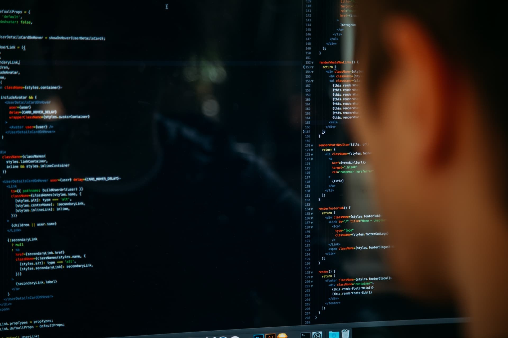
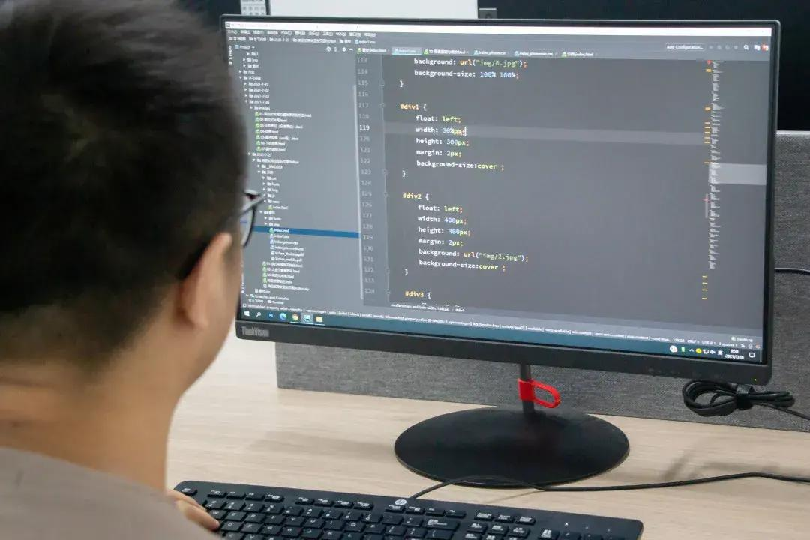
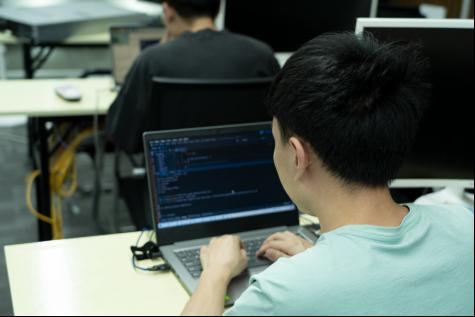

## 前言

  

大家好，我是你们的老朋友——程序员小智。今天我们来聊一聊：**如何成为一名优秀的程序员？**

在回答这个问题之前，我想先问大家一个问题：“你心目中的优秀程序员是什么样子的？”相信不同的人会有不同的答案。那么，我眼中的优秀程序员是什么样的呢？在我看来，一名优秀的程序员应该具备以下几个特点：

1. **技术扎实、经验丰富；** 2. **思维敏捷、逻辑清晰；** 3. **善于沟通、乐于分享；** 4. **不断学习、勇于创新。**接下来，我将从这四个方面入手，为大家详细讲解如何成为一名优秀的程序员。

### 一、技术扎实、经验丰富

要想成为一名优秀的程序员，首先必须要有扎实的技术基础和丰富的实践经验。只有这样，才能更好地解决实际问题，写出高质量的代码。具体来说，我们可以从以下几个方面来提升自己的技术水平：

  

1. **多读经典书籍和学习资料；** 2. **多参加技术培训和讲座；** 3. **多参与开源项目和社区活动；** 4. **多与同行交流和讨论。**通过不断地学习和实践，我们的技术水平将会得到快速提升。

### 二、思维敏捷、逻辑清晰

作为一名优秀的程序员，不仅要拥有扎实的技术基础，还要具备敏锐的思维能力和清晰的逻辑思维能力。只有这样，才能更好地分析和解决问题，写出高质量的代码。具体来说，我们可以从以下几个方面来提升自己的思维能力：

1. **多思考、多提问；** 2. **多分析、多归纳；** 3. **多总结、多反思。**通过不断地思考和分析，我们的思维能力将会得到快速提升。

  

### 三、善于沟通、乐于分享

作为一名优秀的程序员，不仅要有过硬的技术实力，还要有良好的沟通能力和乐于分享的精神。只有这样，才能更好地与其他团队成员协作，共同完成项目任务。具体来说，我们可以从以下几个方面来提升自己的沟通能力：

1. **多倾听、多理解；** 2. **多表达、多反馈；** 3. **多合作、多共赢。**通过不断地沟通和交流，我们的沟通能力将会得到快速提升。

  

### 四、不断学习、勇于创新

作为一名优秀的程序员，不仅要掌握当前最前沿的技术知识，还要时刻保持学习的热情和创新的精神。只有这样，才能跟上时代的步伐，不被淘汰。具体来说，我们可以从以下几个方面来提升自己的学习能力：

1. **多关注行业动态和技术趋势；** 2. **多参加技术沙龙和研讨会；** 3. **多尝试新技术和新工具。**通过不断地学习和探索，我们的学习能力将会得到快速提升。

  

综上所述，要想成为一名优秀的程序员，需要具备扎实的技术基础、敏锐的思维能力和清晰的逻辑思维能力、良好的沟通能力和乐于分享的精神、持续的学习能力和勇于创新的精神。希望这篇文章能够对大家有所帮助，祝大家都能成为优秀的程序员！<TOKENS_UNUSED_1>